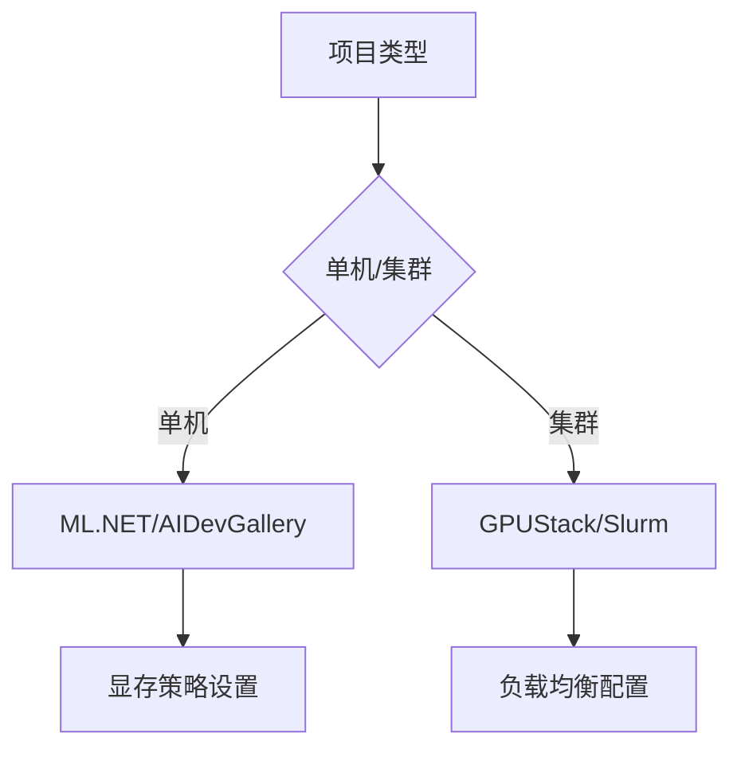

# 🌐 GPU资源动态分配知识库

```dataview
TABLE 适用场景 AS "场景", 核心功能 AS "功能"
FROM #GPU工具 
SORT file.ctime DESC
```


## 📌 核心工具目录
### 1. [[AIDevGallery工具]]
- 类型：本地开发工具
- 标签：`#微软工具` `#HuggingFace集成`
- 关键能力：![[AIDevGallery工具#核心特性]]

### 2. [[GPUStack平台]]
- 类型：集群管理系统
- 标签：`#企业级部署` `#异构GPU`
- 优势对比：![[GPUStack平台#与K8s对比]]

### 3. [[Model Hot Swapping技术]]
- 类型：内存优化技术
- 标签：`#显存优化` `#高并发`
- 性能指标：![[Model Hot Swapping技术#延迟测试数据]]

## 🛠️ 集成方案选择
### 开发环境配置


### 代码示例库
```csharp
// 示例：ML.NET GPU配置
var context = new MLContext();
context.GpuDeviceId = 0;  // 指定GPU设备
context.FallbackToCpu = true; // GPU不可用时自动回退
```

## 📊 性能监控体系
| 指标类型       | 监控工具              | 告警阈值           |
|----------------|-----------------------|--------------------|
| GPU利用率      | NVIDIA-SMI           | >85% 持续5分钟    |
| 显存占用       | AIDevGallery面板     | >90% 总显存       |
| 任务排队时长   | GPUStack Dashboard   | >30秒              |

## 🔗 相关资源
- [[GPU硬件兼容性列表]]
- [[CUDA版本对照表]]
- [[微软ML.NET官方文档]]

