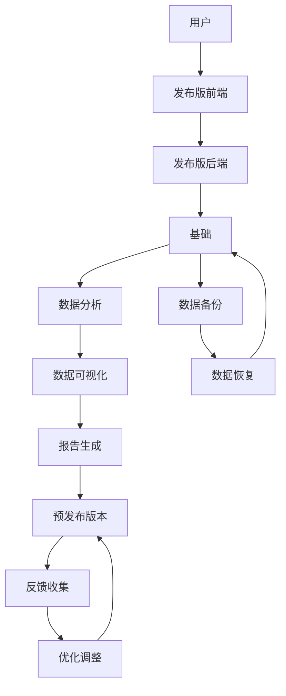

```mermaid
graph TD
    A[用户] --> B[发布版前端]
    B --> C[发布版后端]
    C --> D[基础]
    D --> E[数据分析]
    E --> F[数据可视化]
    F --> G[报告生成]
    G --> H[预发布版本]
    H --> I[反馈收集]
    I --> J[优化调整]
    J --> H
    D --> K[数据备份]
    K --> L[数据恢复]
    L --> D
```

