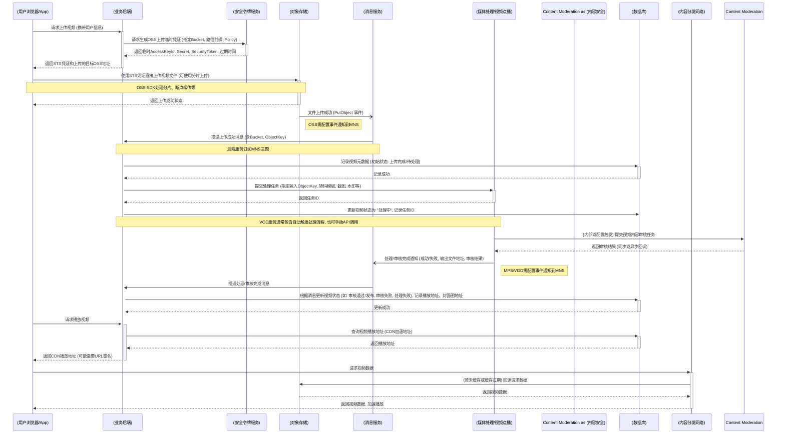

```mermaid
sequenceDiagram
    participant Client as (用户浏览器/App)
    participant Backend as (业务后端)
    participant STS as (安全令牌服务)
    participant OSS as (对象存储)
    participant MNS as (消息服务)
    participant MPS/VOD as (媒体处理/视频点播)
    participant Content Moderation as (内容安全)
    participant DB as (数据库)
    participant CDN as (内容分发网络)

    %% 1. 上传请求与凭证获取
    Client->>+Backend: 请求上传视频 (携带用户信息)
    Backend->>+STS: 请求生成OSS上传临时凭证 (指定Bucket, 路径前缀, Policy)
    STS-->>-Backend: 返回临时AccessKeyId, Secret, SecurityToken, 过期时间
    Backend-->>-Client: 返回STS凭证和上传的目标OSS地址

    %% 2. 客户端直传OSS
    Client->>+OSS: 使用STS凭证直接上传视频文件 (可使用分片上传)
    Note over Client,OSS: OSS SDK处理分片、断点续传等
    OSS-->>-Client: 返回上传成功状态

    %% 3. 上传完成通知 (OSS事件触发 MNS)
    OSS-)MNS: 文件上传成功 (PutObject 事件)
    Note right of OSS: OSS需配置事件通知到MNS

    %% 4. 后端处理上传回调 (或客户端通知)
    MNS->>+Backend: 推送上传成功消息 (含Bucket, ObjectKey)
    Note over MNS,Backend: 后端服务订阅MNS主题
    %% 备选方案: Client ->> Backend: (可选) 客户端通知后端上传完成 (含ObjectKey)
    Backend->>+DB: 记录视频元数据 (初始状态: 上传完成/待处理)
    DB-->>-Backend: 记录成功

    %% 5. 触发视频处理与审核
    Backend->>+MPS/VOD: 提交处理任务 (指定输入ObjectKey, 转码模板, 截图, 水印等)
    MPS/VOD-->>-Backend: 返回任务ID
    Backend->>DB: 更新视频状态为 "处理中", 记录任务ID
    Note over Backend, MPS/VOD: VOD服务通常包含自动触发处理流程, 也可手动API调用
    MPS/VOD->>Content Moderation: (内部或配置触发) 提交视频内容审核任务
    Content Moderation-->>MPS/VOD: 返回审核结果 (同步或异步回调)

    %% 6. 处理/审核结果通知
    MPS/VOD-)MNS: 处理/审核完成通知 (成功/失败, 输出文件地址, 审核结果)
    Note right of MPS/VOD: MPS/VOD需配置事件通知到MNS
    MNS->>+Backend: 推送处理/审核完成消息
    Backend->>+DB: 根据消息更新视频状态 (如: 审核通过/发布, 审核失败, 处理失败), 记录播放地址、封面图地址
    DB-->>-Backend: 更新成功

    %% 7. 视频播放
    Client->>+Backend: 请求播放视频
    Backend->>+DB: 查询视频播放地址 (CDN加速地址)
    DB-->>-Backend: 返回播放地址
    Backend-->>-Client: 返回CDN播放地址 (可能需要URL签名)
    Client->>+CDN: 请求视频数据
    CDN->>OSS: (若未缓存或缓存过期) 回源请求数据
    OSS-->>CDN: 返回视频数据
    CDN-->>-Client: 返回视频数据, 加速播放
```
